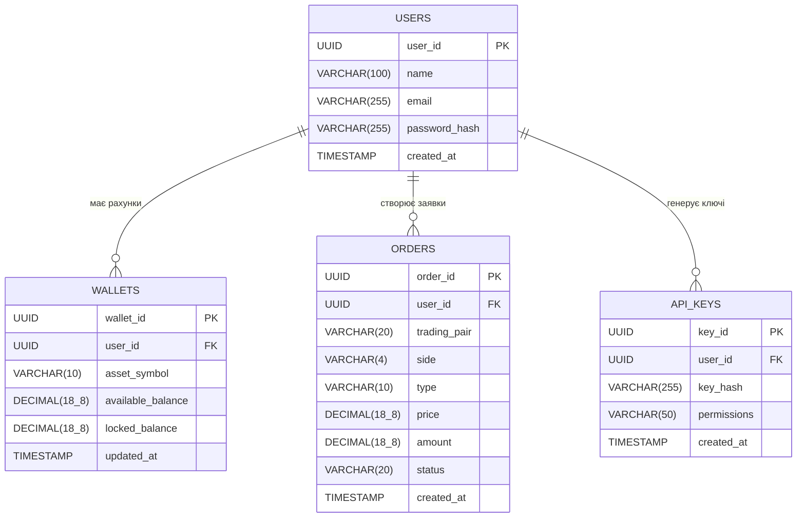
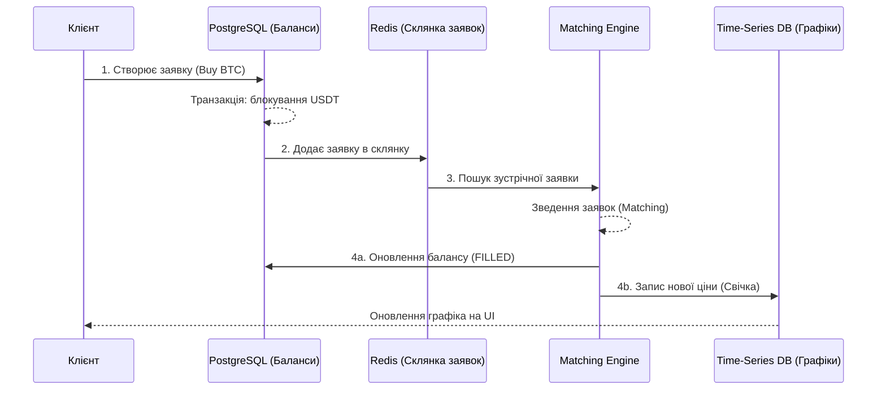

# Домашнє завдання: Проєктування системи даних трейдингової платформи

## Опис обраної системи

Для виконання завдання обрано систему криптовалютної трейдингової платформи (біржі). Така система є чудовим прикладом мікросервісної архітектури, де різні домени даних вимагають принципово різних підходів до зберігання та обробки. Архітектура спроєктована з урахуванням можливості подальшого підключення алгоритмічних ботів та AI-агентів для автоматизованої торгівлі.

## 1. Які дані необхідно зберігати

Систему розділено на три ключові домени:

1. **Користувачі та безпека:** Профілі, API-ключі для доступу, рівні верифікації.
2. **Фінансове ядро:** Баланси користувачів (вільні та заблоковані заявки), історія транзакцій, активні та виконані заявки.
3. **Ринкові дані (Market Data):** Історичні дані про ціни (японські свічки: open, high, low, close, volume) для побудови графіків та аналітики.

## 2. Пріоритети за CAP-теоремою

Оскільки трейдингова платформа поєднує різні за вимогами підсистеми, пріоритети відрізняються залежно від домену:

* **Фінансове ядро (Баланс та Заявки): CP (Consistency + Partition Tolerance).** Консистентність є критичною. Система не може дозволити подвійні витрати або помилки в балансі. У разі проблем із мережею краще відхилити операцію (пожертвувати Availability), ніж допустити розбіжність фінансових даних.
* **Ринкові дані та графіки: AP (Availability + Partition Tolerance).** Для стрічки цін і графіків важливіша доступність і швидкість віддачі. Користувачам краще побачити графік із мілісекундною затримкою оновлення, ніж отримати помилку системи.

## 3. Back-of-the-Envelope розрахунки (спрощено)

* **Аудиторія:** ~100 000 активних користувачів щодня (DAU).
* **Транзакції:** Приблизно 10 заявок на користувача = 1 000 000 заявок щодня.
* **Обсяг даних заявок:** Запис заявок (ID, пари, суми, статус) важить ~200 байт. 1 000 000 * 200 байт ≈ 200 МБ на день. Обсяг невеликий, але вимагає високої пропускної здатності (IOPS).
* **Обсяг ринкових даних:** Тікові дані та свічки для десятків пар генерують гігабайти інформації щотижня, що вимагає ефективного стиснення та індексації за часом.

## 4. Вибір технологій та моделей даних (Polyglot Persistence)

Система використовує поєднання трьох баз даних:

1. **PostgreSQL (Реляційна модель):** Зберігає користувачів, баланси, ключі та історію виконаних заявок. Забезпечує ACID-транзакції. Схема: *Schema-on-write*.
2. **Redis (Key-Value / In-Memory):** Використовується для Order Book (Книги заявок) та роботи Matching Engine (ядра зведення). Забезпечує наднизьку затримку для активних торгів.
3. **InfluxDB або TimescaleDB (Time-Series):** Оптимізована для зберігання історичних ринкових даних та агрегації часових рядів. Схема: *Schema-on-write*.

## 5. ER-діаграма фінансового ядра (Реляційна БД)
Нижче наведено структуру основних таблиць у PostgreSQL, які відповідають за збереження стану користувачів та їхніх коштів.



## 6. Структура документу для ринкових даних (Time-Series)

Для зберігання японських свічок використовується оптимізована структура, де метадані відокремлені від динамічних метрик для ефективного індексування.

```json
{
  "metadata": {
    "exchange": "EventHub_DEX",
    "symbol": "BTC_USDT",
    "interval": "1m",
    "asset_class": "crypto"
  },
  "data": [
    {
      "timestamp": "2026-02-22T17:30:00Z",
      "open": 64230.50,
      "high": 64285.00,
      "low": 64190.20,
      "close": 64250.75,
      "volume": 12.54,
      "quote_asset_volume": 805753.8,
      "number_of_trades": 345
    },
    {
      "timestamp": "2026-02-22T17:31:00Z",
      "open": 64250.75,
      "high": 64310.00,
      "low": 64240.10,
      "close": 64305.20,
      "volume": 15.20,
      "quote_asset_volume": 976985.6,
      "number_of_trades": 412
    }
  ]
}
```

## 7. Інтеграція підсистем: Сценарій укладання угоди (Use Case)

Узгодженість даних між трьома підсистемами досягається за допомогою асинхронного обміну повідомленнями (наприклад, через Kafka):

1. **Блокування коштів:** Користувач створює заявку на купівлю BTC. У PostgreSQL транзакційно списуються USDT з `available_balance` і переміщуються у `locked_balance`.
2. **Додавання в склянку:** Заявка потрапляє в In-Memory БД (Redis).
3. **Зведення (Matching):** Щойно знаходиться зустрічна заявка на продаж, ядро зведення об'єднує їх.
4. **Синхронізація (Fan-out):** Після успішного зведення генерується подія `TradeExecuted`.
    * **Потік 1 (PostgreSQL):** Зменшується `locked_balance` USDT, збільшується `available_balance` BTC. Статус заявки змінюється на `FILLED`.
    * **Потік 2 (Time-Series DB):** Інформація про ціну та об'єм цієї угоди агрегується і записується як нова "свічка" (або оновлює поточну), щоб клієнти одразу побачили зміну графіка на фронтенді.



### Поєднувальні ланки між моделями

Для забезпечення цілісності системи використовуються наступні спільні ідентифікатори:

* **Містком між реляційною БД (PostgreSQL) та In-Memory (Redis)** виступають ідентифікатори `order_id` та `user_id`. PostgreSQL генерує їх, а Redis використовує для ідентифікації заявок у книзі заявок.
* **Містком між фінансовим ядром (PostgreSQL) та ринковими даними (Time-Series БД)** є ідентифікатор активу: поле `trading_pair` у таблиці `Orders` реляційної бази відповідає тегу `symbol` у метаданих Time-Series бази.

## 8. Практична симуляція: Генерація та візуалізація даних
Для перевірки концепції підсистеми **Market Data** згенеруємо синтетичний набір даних (OHLCV) та візуалізуємо його за допомогою інтерактивного графіка.

```python
import json
import random
import pandas as pd
import plotly.graph_objects as go
from datetime import datetime, timedelta, timezone

def generate_market_data(symbol="BTC_USDT", start_price=64000.0, minutes=60):
    market_data = {
        "metadata": {
            "exchange": "EventHub_DEX",
            "symbol": symbol,
            "interval": "1m",
            "asset_class": "crypto"
        },
        "data": []
    }
    
    current_time = datetime.now(timezone.utc) - timedelta(minutes=minutes)
    current_price = start_price
    
    for i in range(minutes):
        volatility = current_price * 0.0005 
        open_price = current_price
        close_price = open_price + random.gauss(0, volatility)
        
        high_price = max(open_price, close_price) + abs(random.gauss(0, volatility / 2))
        low_price = min(open_price, close_price) - abs(random.gauss(0, volatility / 2))
        
        base_volume = random.uniform(5.0, 25.0)
        quote_volume = base_volume * close_price
        trades_count = int(random.uniform(100, 500))
        
        candle = {
            "timestamp": current_time.strftime("%Y-%m-%dT%H:%M:%SZ"),
            "open": round(open_price, 2),
            "high": round(high_price, 2),
            "low": round(low_price, 2),
            "close": round(close_price, 2),
            "volume": round(base_volume, 4),
            "quote_asset_volume": round(quote_volume, 2),
            "number_of_trades": trades_count
        }
        market_data["data"].append(candle)
        current_price = close_price
        current_time += timedelta(minutes=1)
        
    return market_data

synthetic_dataset = generate_market_data(minutes=60)

df = pd.DataFrame(synthetic_dataset["data"])
df['timestamp'] = pd.to_datetime(df['timestamp'])

fig = go.Figure(data=[go.Candlestick(
    x=df['timestamp'],
    open=df['open'],
    high=df['high'],
    low=df['low'],
    close=df['close'],
    name=synthetic_dataset["metadata"]["symbol"]
)])

fig.update_layout(
    title=f"Синтетичні ринкові дані: {synthetic_dataset['metadata']['symbol']}",
    yaxis_title="Ціна (USDT)",
    xaxis_title="Час",
    xaxis_rangeslider_visible=False,
    template="plotly_dark"
)

print("Красивий Вивід (Рендеринг для фронтенду):")
fig.show()

print("Технічний вивід (структура та перші 2 записи для Time-Series БД):")
preview_data = {
    "metadata": synthetic_dataset["metadata"],
    "data": synthetic_dataset["data"][:2]
}
print(json.dumps(preview_data, indent=2))
```

## 9. Висновки

У цій роботі було спроєктовано систему даних для трейдингової платформи з використанням підходу Polyglot Persistence. Розділення даних на реляційну базу (PostgreSQL) для фінансових операцій, In-Memory (Redis) для швидкого зведення заявок та Time-Series БД для аналітики дозволяє системі масштабуватися та задовольняти різні вимоги CAP-теореми в межах одного продукту. Згенерований синтетичний датасет підтверджує готовність структури ринкових даних до подальшої інтеграції з алгоритмічними торговими системами.
